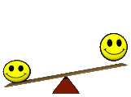

Hi 👋 My name is Maksim
=======================

* 🌍  I'm based in Kharkov
* 🖥️  See my portfolio at [MyPortfolio](http://maxximusan.github.io/portfolio-website/)
* 🧠  I'm learning Next.js
* 🤝  I'm open to collaborating on interesting projects especially related to intellectual and gambling games

### Skills

### Socials

 <a href="https://www.github.com/Maxximusan" target="_blank" rel="noreferrer"> <picture> <source media="(prefers-color-scheme: dark)" srcset="https://raw.githubusercontent.com/danielcranney/readme-generator/main/public/icons/socials/github-dark.svg" /> <source media="(prefers-color-scheme: light)" srcset="https://raw.githubusercontent.com/danielcranney/readme-generator/main/public/icons/socials/github.svg" />  </picture> </a> <a href="https://www.linkedin.com/in/maxximusan/" target="_blank" rel="noreferrer"> <picture> <source media="(prefers-color-scheme: dark)" srcset="https://raw.githubusercontent.com/danielcranney/readme-generator/main/public/icons/socials/linkedin-dark.svg" /> <source media="(prefers-color-scheme: light)" srcset="https://raw.githubusercontent.com/danielcranney/readme-generator/main/public/icons/socials/linkedin.svg" />  </picture> </a>

### Badges

<b>My GitHub Stats</b>

<!-- #2 - relative variant -->
<!-- ## Hi there 👋 -->
<!--
**Maxximusan/Maxximusan** is a ✨ _special_ ✨ repository because its `README.md` (this file) appears on your GitHub profile.

Here are some ideas to get you started:

- 🔭 I’m currently working on ...
- 🌱 I’m currently learning ...
- 👯 I’m looking to collaborate on ...
- 🤔 I’m looking for help with ...
- 💬 Ask me about ...
- 📫 How to reach me: ...
- 😄 Pronouns: ...
- ⚡ Fun fact: ...
-->

<!-- #3 - rahuldkjain -->
l<h1 align="center">Hi 👋, I'm Maksym</h1>
<h3 align="center">I am frontend developer from Kharkov</h3>

- 🌱 I’m currently learning **Next.js**

<h3 align="left">Connect with me:</h3>

<h3 align="left">Languages and Tools:</h3>

                    

<!-- #4 - gif -->

